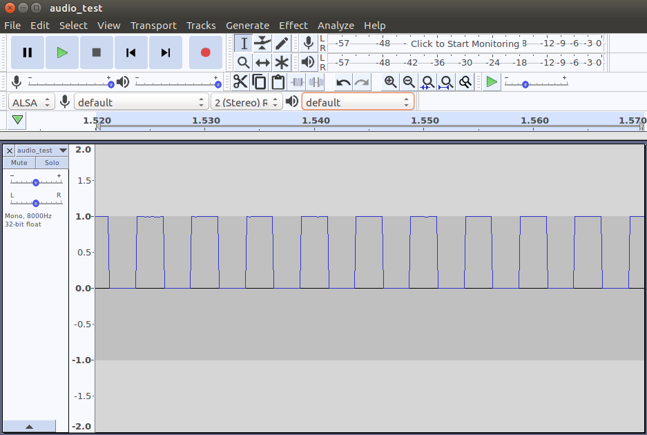

# Audio Recording Using The Nucleo F446RE board
Welcome to *mbed-sauti!* Sauti is the [Kiswahili](https://en.wikipedia.org/wiki/Swahili_language) word for sound.

This repo contains code to record audio using the Nucleo F446RE board. Audio is obtained using a microphone and recorded to an SD card.

## Hardware Requirements

1. [Nucleo-F446RE](https://os.mbed.com/platforms/ST-Nucleo-F446RE/) board
1. [Microphone](https://www.adafruit.com/product/2716) (we will also record a PWM signal directly from the MCU)
1. [Micro SD card adapter](https://store.nerokas.co.ke/index.php?route=product/product&product_id=1082) (Catalex)
1. [Micro SD card](https://store.nerokas.co.ke/index.php?route=product/product&product_id=666)

### Connections

#### SD Card Adapter
The SD card adapter is connected as follows
1. VCC -> 5V
1. GND -> GND 
1. MISO -> D12
1. MOSI -> D11
1. CS -> D10
1. SCK -> D3. Note that you *cannot* use D13 when using LED1 which we do in this code. 

#### PWM Signal Recording
When recording the PWM signal, we connect the PWM output signal D5 (PB_4) to the analog input A1.
We create a 50% duty cycle signal at 200Hz. This is sampled at 8kHz and saved to a file *audio_test.wav*.

#### Microphone
The MEMS microphone is connected as follows
1. Vin -> VDD
1. GND -> GND
1. DC -> A1


## Software

The code in this repo relies on the SD card driver `SDBlockDevice` to record to the micro SD card. Code from the [mbed-os-example-filesystem](https://github.com/ARMmbed/mbed-os-example-filesystem) was used as a guide. The example can also be useful in ensuring that the SD card is correctly set up.

In addition it may be useful to format the SD card as shown [here](https://os.mbed.com/users/janjongboom/code/format-sd-card/).


## Usage
Ensure the Mbed development environment is set up as described in the [Get started with Mbed OS](https://os.mbed.com/docs/latest/tutorials/mbed-os-quick-start.html) page.
After wiring up the hardware, you can either import the repo into the [online compiler](https://os.mbed.com/docs/latest/tutorials/quick-start-online.html) or work offline with [Mbed CLI](https://os.mbed.com/docs/latest/tutorials/quick-start-offline.html).

Import the code:

```
mbed import https://github.com/ciiram/mbed-sauti
cd mbed-sauti
```

Compile the code

Call `mbed compile`, and specify the name of your platform and your toolchain (`GCC_ARM`, `ARM`, `IAR`). For example, for the GCC compiler:

```
mbed compile -m NUCLEO_F446RE -t GCC_ARM 
```

## Sample Output

### PWM Signal
Set the *microphone* flag to *false* in `mbed_app.json`.
The PWM signal is set up as follows
```cpp
if (!MBED_CONF_APP_MICROPHONE) {
  pwm_output.period_ms(1000 * (1.0 / MBED_CONF_APP_PWM_SIGNAL_FREQ));
  pwm_output.write(MBED_CONF_APP_PWM_DUTY_CYCLE / 100.0);
}
```

We record it for `duration-sec` seconds. This is also set in `mbed_app.json`.

You can view the recorded 200Hz PWM signal in *audio_test.wav* using [Audacity](https://www.audacityteam.org/). A segment is shown below with 10 periods represented in the 50ms shown.



[Audio sample of PWM signal at 200Hz](audio/pwm.wav)

### Audio Signal
Set the *microphone* flag to *true* in `mbed_app.json`.
A screenshot of an audio signal of the swahili word *moja* is shown below


A spectrogram of the same signal clearly shows the two syllables and the [formants](https://en.wikipedia.org/wiki/Formant).


[Moja](audio/moja.wav)


